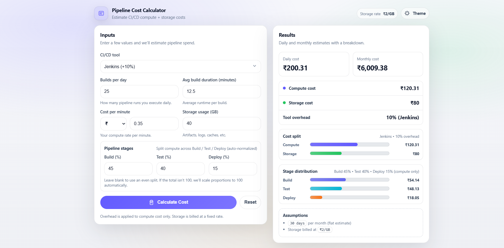

# 🚀 Pipeline Cost Calculator

## 📌 Overview

This project is a web-based tool that estimates the cost of CI/CD pipeline execution using DevOps concepts. It simulates tools like Jenkins and models pipeline stages such as Build, Test, and Deploy.

---

## ⚙️ Features

* Calculate daily and monthly pipeline cost
* Supports CI/CD tools:

  * Jenkins
  * GitHub Actions
  * GitLab CI
* Cost breakdown:

  * Compute cost
  * Storage cost
  * Tool overhead
* Pipeline stages:

  * Build
  * Test
  * Deploy
* Visual cost distribution
* Responsive UI

---

## 🧠 Concept Used

This project simulates CI/CD pipelines instead of integrating real Jenkins. It estimates cost based on:

* Number of builds
* Execution time
* Storage usage
* Tool-specific overhead

---

## 🛠️ Technologies Used

* HTML
* CSS
* JavaScript

---

## 🎯 Objective

To model and estimate the cost of running CI/CD pipelines in real-world DevOps environments.

---

## ▶️ How to Run

1. Download the project
2. Open `index.html` in any browser

---

## 📊 Example

Users can input pipeline parameters and instantly view:

* Daily cost
* Monthly cost
* Stage-wise distribution

  

---

## 📌 Note

This is a simulation-based project and does not require actual Jenkins setup.

